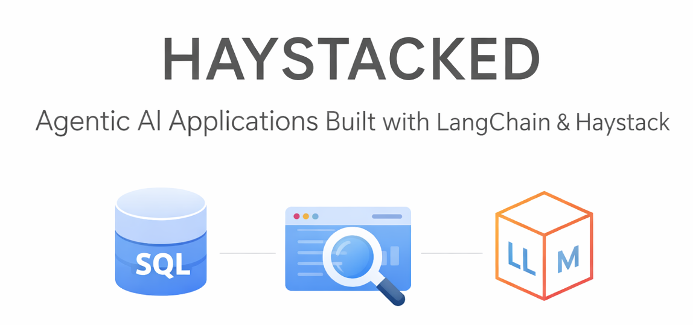
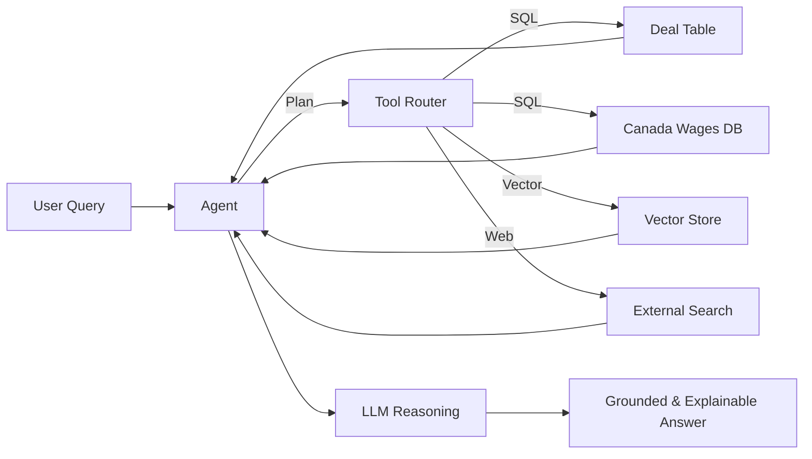

# 🧠 Haystacked

> **Agentic AI applications built with LangChain & Haystack — grounded, explainable, and production-ready.**

<div align="center">



<br/><br/>

[](https://www.python.org)
[](https://www.langchain.com/)
[](https://haystack.deepset.ai)
[](#)
[](#)
[](https://www.gnu.org/licenses/gpl-3.0)

<br/>

[](https://www.linkedin.com/in/aiXpert)
[](https://twitter.com/aiXpertLab)

</div>

---

## 🚀 Mission

**Haystacked exists to build real AI agents — not demos.**

We design **agentic AI applications** that connect LLMs to real systems:
databases, vector stores, and external tools — with correctness, transparency,
and production constraints as first-class concerns.

LLMs are powerful.  
**Agents are responsible.**

---

## 🧠 What Haystacked Builds

- 🤖 **Agentic AI systems** using LangChain and Haystack  
- 🧰 **Tool-orchestrated workflows** (SQL, retrieval, web search, APIs)  
- 📊 **Data-grounded reasoning** over structured and unstructured sources  
- 🔐 **Production-safe execution** with guardrails and observability  
- ✅ **Explainable answers** backed by traceable evidence  

This is not prompt engineering.  
This is **systems engineering with LLMs**.

---

## 🏗️ Agent Architecture



---

## 🧩 Core System Components

### 🔹 SQL Tooling
- Schema-aware query generation
- Read-only execution
- Parameterized queries
- Row limits and timeouts

### 🔹 Vector Retrieval
- Semantic similarity search
- Context injection for reasoning
- Historical and domain grounding

### 🔹 External Search
- Real-time data enrichment
- Clearly labeled non-authoritative sources
- Never overrides internal data

---

## 🔐 Safety & Guardrails

Every agent execution is constrained by design:

- ❌ No data mutation (`INSERT`, `UPDATE`, `DELETE`, `DROP`)
- ✅ `SELECT`-only SQL queries
- ⏱ Execution time limits
- 📉 Result size caps
- 🔍 Pre-execution validation

```python
def validate_sql(query: str) -> None:
    assert query.strip().lower().startswith("select")
    forbidden = ["insert", "update", "delete", "drop", "alter"]
    for keyword in forbidden:
        if keyword in query.lower():
            raise ValueError("Forbidden SQL operation")
```

---

## 🧠 Explainability by Default

Every response produced by Haystacked includes:

- **Answer** — the conclusion
- **Sources** — where the data came from
- **Reasoning** — how the conclusion was derived

Example:

```text
Answer:
Average wage growth for Ontario tech roles is 4.2%.

Sources:
- Canada Wages Database (2023–2024)
- Vector context: regional labor trends

Reasoning:
Filtered by province and industry, then compared year-over-year averages.
```

---

## 📌 Example Agent Queries

- “What’s the average wage growth for tech roles in Ontario?”
- “Compare fintech deal sizes between Q2 and Q3”
- “Are deal trends aligned with labor market signals?”
- “Summarize financial risks using current wage data”

---

## 🛠️ Technology Stack

- **Python 3.13**
- **LangChain** — agent orchestration
- **Haystack** — retrieval & document pipelines
- **SQL (Postgres / MySQL)** — authoritative data access
- **Vector Stores (pgvector / Chroma)** — semantic retrieval
- **LLMs (GPT-5 class)** — reasoning & synthesis

---

## 🧪 Built for Production

- Deterministic tool execution
- Modular, extensible agent design
- Framework-agnostic architecture
- Observability-ready reasoning traces

---

## 🔮 Roadmap

- [ ] Multi-agent collaboration
- [ ] Cost-aware routing
- [ ] Caching & replay
- [ ] Human-in-the-loop review
- [ ] Visualization of reasoning traces

---

**Haystacked — AI agents that reason over reality.**
