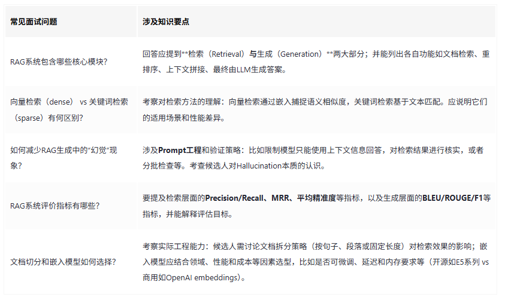

不是普通全栈面试那种“React 生命周期”或“HTTP 缓存策略”，而是：

关于 RAG/LLM 的深度问题：

“你用过哪些 embedding 模型？在什么场景下选哪个？”

“chunk 大小怎么确定？你用什么方法评测？”

“检索召回率低怎么办？你做过混合检索吗？”

“guardrails 怎么实现？你怎么防止 prompt injection？”

“你用的向量数据库是什么？为什么选它？”

关于落地的问题：

“你做过生产级的 RAG 应用吗？遇到的最大坑是什么？”

“monitoring 怎么做的？你怎么知道检索质量在下滑？”

“如果模型输出不对，你怎么定位是检索问题还是生成问题？”

关于协作的问题：

“如果我给你一个新的 embedding 模型，你多久能把它集成到现有系统？”

“我训练了一个特定领域的模型，你怎么把它包装成 API 给前端用？”

“你怎么跟业务方沟通，把一个 AI 能力变成他们能理解的功能？”

3. 他对你的期待
维度	期待
AI 理解深度	不是调 API 的，是真的理解 embedding、检索、RAG 原理，能跟他讨论 trade-off
工程能力	能独立把模型封装成 API、做前端 demo、写测试、部署上线
产品思维	知道怎么把技术能力变成业务可用的功能，能跟业务方沟通
主动性	不需要他手把手教，能自己探索、试错、给方案
你的面试策略
1. 展现“能跟他对话”的能力
不是背概念，而是：

聊你实际做过的 RAG 项目：用了什么 embedding、为什么选它、chunk 怎么切的、召回率多少、怎么优化的

聊你踩过的坑：比如 embedding 模型没加 query prefix 导致召回率暴跌、chunk 边界切断关键信息、向量数据库选型踩坑等

聊你的评测方法：怎么测 recall、MRR、NDCG，怎么用 RAGAS 做端到端评测

2. 展现“能帮他落地”的能力
强调你做过的事：

“我独立搭过生产级的 RAG 系统，从 embedding 选型到向量数据库到 API 封装到前端 demo”

“我知道怎么把模型部署成 API，怎么加缓存，怎么做监控”

“我能跟业务方沟通，把他们的需求翻译成技术方案，两周出原型”

3. 准备问他问题（展现你的思考深度）
“中央 AI 团队现在提供了哪些现成能力？LLM 网关、向量数据库、还是模型即服务？”

“你现在最想落地的场景是什么？是内部效率工具，还是面向客户的产品？”

“你希望这个岗位帮你解决的最大痛点是什么？”

“模型是你自己训练的，还是用开源微调？我需要理解模型的哪些特性？”


## RAG 评测指标完整清单

分两类：**检索指标**（衡量检索质量）和 **生成指标**（衡量回答质量）。

---

## 一、检索指标（衡量“找没找对”）

### 1. Recall@K（召回率）
**衡量**：找全了没

```
Recall@K = 前K个结果中相关文档数 ÷ 系统中总相关文档数
```

| 场景 | 合理目标 |
|------|---------|
| 客服问答 | >90% |
| 企业知识库 | >85% |
| 技术文档 | >80% |

**代码**：
```python
def recall_at_k(relevant_ids, retrieved_ids, k):
    retrieved_set = set(retrieved_ids[:k])
    hits = len(relevant_ids & retrieved_set)
    return hits / len(relevant_ids) if relevant_ids else 0
```

---

### 2. Precision@K（精确率）
**衡量**：找对了没（返回的结果里多少有用）

```
Precision@K = 前K个结果中相关文档数 ÷ K
```

**示例**：返回5篇，相关3篇 → Precision@5 = 60%

```python
def precision_at_k(relevant_ids, retrieved_ids, k):
    retrieved_set = set(retrieved_ids[:k])
    hits = len(relevant_ids & retrieved_set)
    return hits / k
```

---

### 3. MRR（Mean Reciprocal Rank，平均倒数排名）
**衡量**：第一个正确答案排第几（用户最关心第一个对不对）

```
MRR = 平均(1 / 第一个正确答案的排名)
```

**示例**：
- Query1：第一个正确答案在第1位 → 1/1 = 1.0
- Query2：第一个正确答案在第3位 → 1/3 ≈ 0.33
- Query3：没找到正确答案 → 0
- **MRR** = (1.0 + 0.33 + 0) / 3 ≈ 0.44

```python
def reciprocal_rank(relevant_ids, retrieved_ids):
    for rank, doc_id in enumerate(retrieved_ids, 1):
        if doc_id in relevant_ids:
            return 1 / rank
    return 0

def mrr(test_set, retrieval_func):
    rr_sum = 0
    for item in test_set:
        retrieved = retrieval_func(item["query"])
        rr_sum += reciprocal_rank(set(item["relevant_ids"]), retrieved)
    return rr_sum / len(test_set)
```

---

### 4. NDCG@K（归一化折损累积增益）
**衡量**：考虑排名位置的召回质量（排前面的权重更高）

```
DCG@K = Σ(相关度 / log2(rank+1))
IDCG@K = 理想情况下的最大DCG
NDCG@K = DCG / IDCG
```

**简化版**（相关度只有0/1）：
```python
import numpy as np

def ndcg_at_k(relevant_ids, retrieved_ids, k):
    # DCG: 排名越靠前贡献越大
    dcg = 0
    for rank, doc_id in enumerate(retrieved_ids[:k], 1):
        if doc_id in relevant_ids:
            dcg += 1 / np.log2(rank + 1)
    
    # IDCG: 理想情况（所有相关文档排在最前面）
    ideal_ranking = list(relevant_ids)[:k]
    idcg = 0
    for rank in range(1, min(len(ideal_ranking), k) + 1):
        idcg += 1 / np.log2(rank + 1)
    
    return dcg / idcg if idcg > 0 else 0
```

**为什么用NDCG**：Recall 不关心排名，NDCG 关心“好的排前面”。

---

## 二、生成指标（衡量“答没答对”）

### 5. Faithfulness（忠实度）
**衡量**：答案是否基于检索到的内容（有没有胡说八道）

```
Faithfulness = 答案中可被检索内容支撑的陈述比例
```

**示例**：
- 检索内容："车险理赔需要驾驶证和行驶证"
- 答案："需要驾驶证、行驶证和身份证"
- Faithfulness = 2/3 ≈ 0.67（身份证不在检索内容里）

**用 RAGAS 自动算**：
```python
from ragas.metrics import faithfulness

result = evaluate(dataset, metrics=[faithfulness])
```

---

### 6. Answer Relevancy（答案相关性）
**衡量**：答案是否直接回答了问题（有没有跑题）

```
Answer Relevancy = 答案与问题的语义相似度
```

**示例**：
- 问题："车险理赔需要什么材料？"
- 答案："车险理赔流程包括报案、查勘、定损、核赔、结案"
- 相关性低（答非所问，讲流程没讲材料）

---

### 7. Context Recall（上下文召回率）
**衡量**：检索到的内容是否包含了答案所需的信息

```
Context Recall = 答案需要的黄金上下文有多少被检索到了
```

这个介于检索指标和生成指标之间——检索到了，但生成时没用上，也算失败。

---

### 8. Context Precision（上下文精确率）
**衡量**：检索到的内容里，有多少是对生成答案有用的

```
Context Precision = 有用内容 ÷ 总检索内容
```

避免“检索了一堆，有用的就一句”的情况。

---

## 三、指标速查表

| 指标 | 衡量什么 | 公式 | 范围 |
|------|---------|------|------|
| **Recall@K** | 找全了没 | 找到的相关数 / 总相关数 | 0-1，越高越好 |
| **Precision@K** | 找对了没 | 找到的相关数 / K | 0-1，越高越好 |
| **MRR** | 第一个答案排第几 | 平均(1/排名) | 0-1，越高越好 |
| **NDCG@K** | 排名质量 | 加权位置得分 | 0-1，越高越好 |
| **Faithfulness** | 有没有胡说 | 答案被检索支撑的比例 | 0-1，越高越好 |
| **Answer Relevancy** | 跑没跑题 | 答案与问题的相关性 | 0-1，越高越好 |
| **Context Recall** | 信息够不够 | 答案所需信息被检索的比例 | 0-1，越高越好 |
| **Context Precision** | 检索噪音 | 有用信息占检索结果的比例 | 0-1，越高越好 |

---

## 四、完整评测脚本模板

```python
import numpy as np
from typing import List, Set

class RAGEvaluator:
    def __init__(self, retrieval_system, llm=None):
        self.retrieval_system = retrieval_system
        self.llm = llm  # 可选，用于生成指标
    
    def recall_at_k(self, relevant: Set[int], retrieved: List[int], k: int) -> float:
        """召回率"""
        if not relevant:
            return 0.0
        hits = len(relevant & set(retrieved[:k]))
        return hits / len(relevant)
    
    def precision_at_k(self, relevant: Set[int], retrieved: List[int], k: int) -> float:
        """精确率"""
        if k == 0:
            return 0.0
        hits = len(relevant & set(retrieved[:k]))
        return hits / k
    
    def mrr(self, relevant: Set[int], retrieved: List[int]) -> float:
        """平均倒数排名"""
        for rank, doc_id in enumerate(retrieved, 1):
            if doc_id in relevant:
                return 1.0 / rank
        return 0.0
    
    def ndcg_at_k(self, relevant: Set[int], retrieved: List[int], k: int) -> float:
        """NDCG"""
        dcg = 0.0
        for rank, doc_id in enumerate(retrieved[:k], 1):
            if doc_id in relevant:
                dcg += 1.0 / np.log2(rank + 1)
        
        # IDCG: 理想情况
        ideal_count = min(len(relevant), k)
        idcg = sum(1.0 / np.log2(i + 1) for i in range(1, ideal_count + 1))
        
        return dcg / idcg if idcg > 0 else 0.0
    
    def evaluate_retrieval(self, test_set: List[dict], k: int = 5) -> dict:
        """
        test_set 格式:
        [
            {"query": "...", "relevant_ids": [1,2,3]},
            ...
        ]
        """
        recalls = []
        precisions = []
        mrrs = []
        ndcgs = []
        
        for item in test_set:
            query = item["query"]
            relevant = set(item["relevant_ids"])
            
            # 执行检索
            retrieved = self.retrieval_system.search(query, top_k=k)
            retrieved_ids = [doc.id for doc in retrieved]
            
            recalls.append(self.recall_at_k(relevant, retrieved_ids, k))
            precisions.append(self.precision_at_k(relevant, retrieved_ids, k))
            mrrs.append(self.mrr(relevant, retrieved_ids))
            ndcgs.append(self.ndcg_at_k(relevant, retrieved_ids, k))
        
        return {
            f"recall@{k}": np.mean(recalls),
            f"precision@{k}": np.mean(precisions),
            "mrr": np.mean(mrrs),
            f"ndcg@{k}": np.mean(ndcgs)
        }
    
    def evaluate_generation(self, test_set: List[dict]) -> dict:
        """
        test_set 格式:
        [
            {"query": "...", "contexts": [...], "answer": "...", "reference": "..."},
            ...
        ]
        需要安装 ragas
        """
        try:
            from ragas import evaluate
            from ragas.metrics import faithfulness, answer_relevancy, context_recall
            
            result = evaluate(
                dataset=test_set,
                metrics=[faithfulness, answer_relevancy, context_recall]
            )
            return result
        except ImportError:
            print("请安装 ragas: pip install ragas")
            return {}

# 使用示例
evaluator = RAGEvaluator(retrieval_system=my_retriever)
retrieval_scores = evaluator.evaluate_retrieval(test_set, k=5)
print(retrieval_scores)
```

---

## 五、面试时怎么聊

如果被问到“你怎么评测 RAG 系统”，可以这样说：

> “我把评测分成两层。第一层是检索指标，主要看 recall@5 和 MRR——recall 衡量找没找全，MRR 衡量第一个正确答案排第几。第二层是生成指标，用 RAGAS 算 faithfulness 和 answer relevancy，确保答案不是瞎编的。我一般会建一个 200 条 query 的测试集，跑脚本自动化评测，每次调参数几秒钟就能看到效果变化。”

这样既有层次，又有工具，还有数据规模——听起来像真干过的。

需要我帮你把整套评测体系做成一个可运行的脚本文件吗？





问题3

面试官：明白了。你刚才提到了评价指标，那么您能描述一下RAG是如何进行效果评分的吗？
候选人：RAG的效果评估主要针对检索和生成环节。我们可以使用平均倒排率，排序指标来进行评估。
问题4

面试官：那么在生成环节，你是如何进行评估的呢？
候选人：在生成环节，首先会使用量化指标，如ROUGE-L分数和文本相似度、关键词重合度等。其次评估生成答案的多样性，查看模型是否能够生成多种合理的答案。此外，引入人工评估，进行反向测试，主要评估模型的复杂性和质量。
问题5:

面试官：好的，你觉得RAG在处理问题时有哪些挑战？
候选人：RAG面临的挑战主要有两个：一是生成结果与数据源不一致，二是问题超出了模型的认知范围。对于第一种，可能是训练数据与源数据不一致，或者是编码理解能力不足。对于第二种情况，可能是用户的问题超出了模型的处理范围。

问题6

面试官：针对模型幻觉，你有哪些解决思路？
候选人：解决这些问题，可以考虑引入更精确的数据源，消除虚假数据，并加入纠偏规则，比如采用re-act方法，让大模型对输出结果进行反思。另一种思路是集成知识库，不仅仅考虑向量匹配，还要考虑知识图谱中的三元组，将结构化的相关点数据集成到RAG系统中，以增强系统的推理能力。
问题7

面试官：在实际项目中，您如何处理各种边界的case，意外的情况？
候选人：这需要具体情况具体分析。对于无效问题，即知识库中没有答案的问题，需要进行准入判断，通常使用二分类模型加提示来处理。对于随时间变化的问题，我们可以在推理模块中添加规则和提示词，使模型在不确定时能够给出合适的回答。对于格式错误的问题，比如模型生成了无法解析的答案，我们可以使用备份的代理大模型，在解析失败时直接生成答案。

Q3：如何定义RAG中的“相关文档”？

A3：通过语义相似度（如向量检索）或关键词匹配（如BM25）从知识库中筛选与Query最相关的Top-K文档。

Q4：RAG中主流检索器有哪些？各有什么优势？

A4：① 稀疏检索（如BM25）：基于词频，擅长精确关键词匹配，但无法处理语义泛化；② 稠密检索（如DPR、Embedding模型）：用向量捕捉语义，支持语义相似度搜索，但依赖训练数据和算力；③ 混合检索：结合两者，平衡准确性与召回率。

Q5：知识库文档分块（Chunking）有哪些策略？

A5：① 固定大小分块：简单高效，可能割裂语义；② 按语义分割：（如句边界、标题）：保持上下文完整，需NLP工具支持；③ 递归分块：多级分块兼顾不同粒度需求。

Q6：为什么需要向量归一化（Vector Normalization）？

A6：归一化（如L2归一化）使向量仅保留方向信息，避免长度影响相似度计算（余弦相似度=向量点积）。

Q7：生成阶段如何融合检索结果？

A7：两种主流方式：
① Concatenation：将Query与检索文档拼接输入LLM（如[CLS] Query [SEP] Doc1 [SEP] Doc2 ...）；
② Attention注入：在LLM的中间层注入文档向量（如Fusion-in-Decoder）。

Q8：RAG中如何避免生成无关内容？
A8：① 设置置信度阈值，仅当检索文档置信度高时才生成；
② 添加提示词约束（如“仅根据以下文档回答：...”）；
③ 使用Self-RAG等方案让模型自主判断是否引用检索结果。

Q9：为什么需要重排序（Re-Ranking）？列举常见方法
A9：初检（如向量检索）返回的Top-K需进一步精排。
方法包括：交叉编码器（Cross-Encoder）：计算Query-Doc精细相关性得分；
LLM重排：用Prompt让大模型直接打分（成本高）。

Q10：RAG与Fine-tuning如何结合？
A10：① 两阶段训练：先微调检索器适配领域，再固定检索器微调生成器；② 端到端优化：如RA-DIT联合训练检索器和生成器。